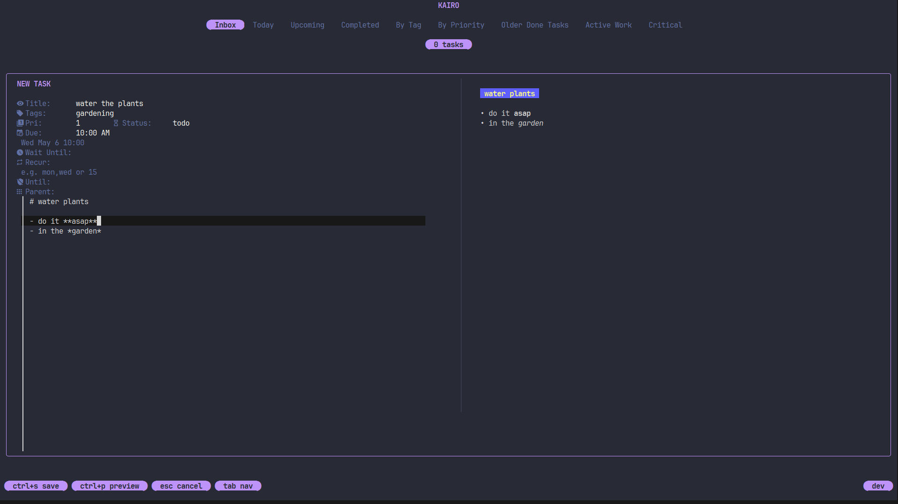
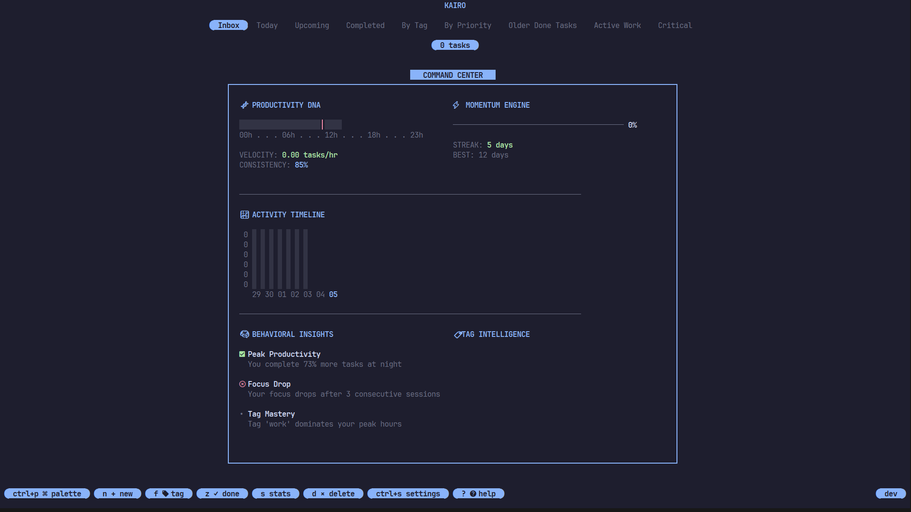
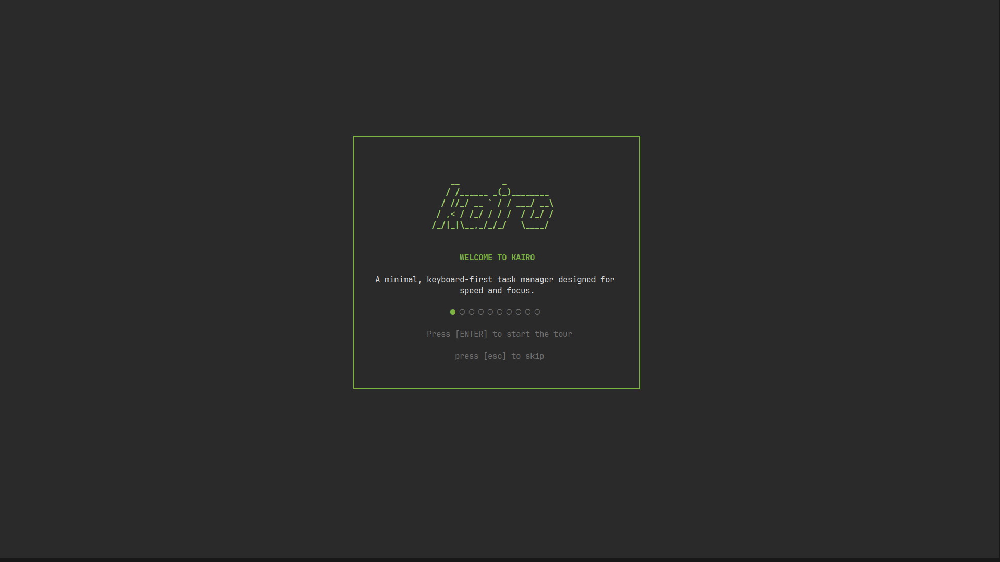
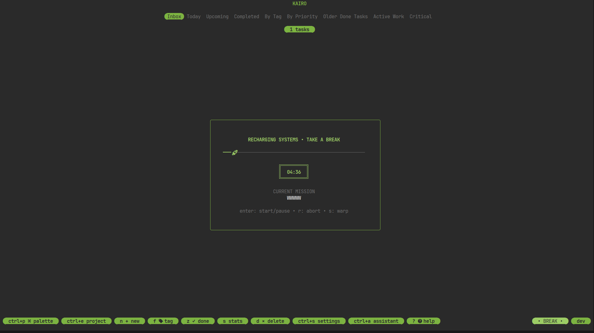
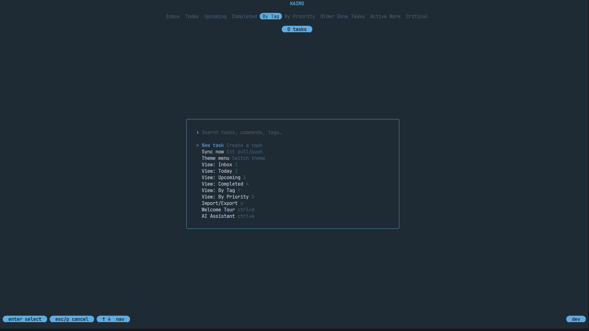

<div align="center">


# Kairo

**The terminal task manager for developers who live in their editor.**

A premium, minimalist task manager designed for focus. Kairo strips away the noise, relying on structured whitespace and refined typography to keep you in your flow.

<br/>

[](https://github.com/programmersd21/kairo/releases)
[](https://github.com/programmersd21/kairo/actions)
[](https://opensource.org/licenses/MIT)

<br/>


</div>

**YouTube tutorial playlist (in dev):**  
https://youtube.com/playlist?list=PLvaz_NYJcySmNh28QzxLqV5HRrTslEaUo&si=XY8YvRnrhqxqU6RD

---

## Why Kairo?

Kairo is built on the philosophy of "Calm Tech." We focus on your data, not our UI.

| Premium Minimalist Feature | Benefit |
|---|---|
| **Momentum Dashboard** | Empty states are now data-rich, bordered modules. |
| **White-Space-First UI** | No borders, no clutter — just content. |
| **Monochrome Design** | Neutral core, semantic-only color highlights. |
| **Typography Hierarchy** | Clear visual focus through font weight and scale. |
| **Fluid Motion** | Sub-300ms transitions that feel "alive." |

---

## Quick Start

**macOS (Homebrew)**
```bash
brew install programmersd21/kairo/kairo
```

**Linux / macOS**
```bash
curl -fsSL https://raw.githubusercontent.com/programmersd21/kairo/main/scripts/install.sh | bash
```

**Windows (PowerShell)**
```powershell
iwr -useb https://raw.githubusercontent.com/programmersd21/kairo/main/scripts/install.ps1 | iex
```

**Go**
```bash
go install github.com/programmersd21/kairo/cmd/kairo@latest
```

Then just run:
```bash
kairo
```

Press `n` to create your first task. `ctrl+s` to save. That's it.

> Works best on Alacritty. Some terminals may have rendering quirks — see [#16](https://github.com/programmersd21/kairo/issues/16).

---

## Features


### ⚡ Genuinely Fast
Sub-millisecond fuzzy search. Vim bindings (`j/k/gg/G`). Natural language deadlines like `tomorrow 10am` or `next friday`. Full keyboard control — you never touch the mouse.

### 🗂 Nested Tasks & Hierarchy
Organize work into deep hierarchies and separate projects. Nest tasks via the **Parent** field in the editor, switch projects with `ctrl+e` to focus your workspace, and export/import with full structure preserved — across JSON, CSV, Markdown, and plain text.

### 🔁 Recurring Tasks
Tasks reappear automatically on a schedule. Weekly (`mon,wed,fri`) or monthly (`15`). When completed, Kairo generates the next instance immediately with a smart due-date preview.

### 🔒 Your Data, Locally
SQLite with WAL mode. Fully offline. Optional Git-backed sync — no backend, no account, no lock-in. Export to JSON, CSV, Markdown, or plain text on demand. Project organization is preserved in your database.

### 🧭 Interactive Stats Dashboard & Focus Engine
Press `s` to open a next-gen "Command Center". Visualize your **Productivity DNA**, track real-time momentum, and get behavioral insights. 

**Focus Engine**: Press `f` to launch the native Pomodoro timer. Track deep work sessions directly against your active tasks. When a session is active, Kairo displays a "DEEP WORK" pulse in the footer.

### 🤖 AI — Optional, Never Intrusive
Gemini integration (`gemini-3.1-flash-lite-preview` / `gemini-2.5-flash-lite` / `gemini-2.0-flash-lite`). Toggle with `ctrl+a`. Create and manage complex recurring tasks with natural language, including assigning to specific projects. Invisible until you need it.

### 🎨 Beautiful by Default
32 built-in themes with edge-to-edge background coverage. Live switching with `t`. Bento-style layout. Real-time Markdown preview (`ctrl+p`), with configurable default state in `config.toml` under `[edit]`. Cinematic create/complete/delete animations — or disable them entirely in `config.toml`.

### 🧩 Extensible to the Core
A Lua plugin system hooks into task events. A headless CLI API enables full scripting. An MCP server opens Kairo to AI agents — with complete support for recurring schedules and nested hierarchies.

### ↩️ Undo & Redo
Kairo now tracks your every move with a local history engine. Instantly reverse mistakes with `ctrl+z` or re-apply undone actions with `ctrl+y`. Supports task creation, deletion (including bulk), editing, and status changes. Everything is synchronized live with the database.

### 🎨 Tag Highlighting
Color-code your tags directly in `config.toml`. Supports hex codes or theme-aware aliases (e.g., `accent`).

```toml
[tags.highlight]
work    = { fg = "#CCCCCC" }
private = "fg=#EEEEEE,bg=#0000FF,bold"
diy     = "bg=accent"
```

---

## Keyboard Shortcuts

| Key | Action |
|---|---|
| `n` | New task |
| `D` | Duplicate task |
| `e` | Edit task |
| `z` | Complete task |
| `ctrl+d` | Duplicate task |
| `Space` | Select task / Collapse subtasks |
| `s` | Stats dashboard |
| `f` | Focus engine |
| `ctrl+f` | Filter by tag |
| `ctrl+e` | Switch project |
| `p` | Manage plugins |
| `t` | Switch theme |
| `ctrl+p` | Command palette / Markdown preview |
| `ctrl+a` | AI panel |
| `ctrl+s` | Settings |
| `x` | Import / Export |
| `?` | Help |
| `ctrl+z` | Undo last action |
| `ctrl+y` | Redo last undone |
| `ctrl+w` | Welcome tour |

<div align="center">
  
  
  
  
  
  
  
  
  
</div>

---

## CLI Automation

Kairo exposes a full CLI API for scripting and CI pipelines, with complete support for `parent_id` and `collapsed` state:

```bash
# Create a task
kairo api create --title "Finish report" --priority 1

# List by tag
kairo api list --tag work

# Mark complete
kairo api update --id <id> --status done

# Export everything
kairo export --format markdown
```

---

## Lua Plugin System

```lua
local plugin = {
    id = "my-plugin",
    name = "My Plugin",
    version = "1.0.0"
}

kairo.on("task_create", function(event)
    kairo.notify("New task: " .. event.task.title)
end)

return plugin
```

Browse [sample plugins →](https://github.com/programmersd21/kairo/tree/main/plugins)

---

## Architecture

```
Input  (CLI · TUI · Lua · AI)
       ↓
Task Service  (single source of truth)
       ↓
SQLite (WAL)  +  optional Git sync
       ↓
Bubble Tea TUI  (instant rendering)
```

**Stack:** Bubble Tea · Lip Gloss · SQLite (WAL) · GopherLua · Gemini API · Git

---

## Everything Included

| Feature | Status |
|---|---|
| Local-first SQLite storage | ✅ |
| Nested tasks & folders | ✅ |
| 32 themes, live switching | ✅ |
| Keyboard-only workflow | ✅ |
| Recurring tasks | ✅ |
| Git sync (no backend) | ✅ |
| Lua plugin system | ✅ |
| CLI automation API | ✅ |
| AI assistant (optional) | ✅ |
| MCP server | ✅ |
| Free & open source | ✅ |

---

## Configuration

Kairo can be configured via `config.toml` in your application data directory.

### Task List
You can customize the fields shown on the right side of the task list:

```toml
[list.order]
right = ["tags", "due", "priority"]
```

Valid values for `right` are: `tags`, `due`, `priority`.

### Task Fields
*   **Minimal Due Mode**: Abbreviate "overdue" to "OD" and use a fixed-width column for consistent task list alignment. Enabled by default.
    ```toml
    [list.fields.due]
    minimal = true
    ```
*   **wait_until**: Hide a task from the task list until the specified datetime. If the task is recurring, new instances are not generated/shown until `wait_until` has passed. Format: `yyyy-MM-dd HH:mm`.
*   **until**: Stop generating new recurring instances after the specified datetime. Existing instances may remain visible. Format: `yyyy-MM-dd HH:mm`.

Auto-generated on first run at:

- **Linux:** `~/.config/kairo/config.toml`
- **macOS:** `~/Library/Application Support/kairo/config.toml`
- **Windows:** `%APPDATA%\kairo\config.toml`

| Option | Description | Default |
|---|---|---|
| `theme` | UI theme name | `catppuccin` |
| `vim_mode` | Vim keybindings | `false` |
| `show_help` | Help footer | `true` |
| `show_id` | Task IDs in detail view | `true` |
| `animations` | UI animations | `true` |
| `rainbow` | Animated rainbow logo | `false` |

Prefer not to edit files? `ctrl+s` opens the in-app settings menu.

---

## Roadmap

- Encrypted multi-workspace support
- Event-sourced sync engine
- Sandboxed plugin environment
- Smart task suggestions
- Plugin marketplace
- Streaming performance optimizations

---

## Star History

<a href="https://www.star-history.com/?repos=programmersd21%2Fkairo&type=date&legend=top-left">
  <picture>
    <source media="(prefers-color-scheme: dark)" srcset="https://api.star-history.com/chart?repos=programmersd21/kairo&type=date&theme=dark&legend=top-left" />
    <source media="(prefers-color-scheme: light)" srcset="https://api.star-history.com/chart?repos=programmersd21/kairo&type=date&legend=top-left" />
    
  </picture>
</a>

---

## Contributing

PRs are welcome — especially for themes, plugins, performance, and docs. If something bugs you, fix it.

Huge thanks to [@Tornado300](https://github.com/Tornado300) and [@riodelphino](https://github.com/riodelphino) for key bug fixes and improvements that made Kairo better for everyone.

---

<div align="center">

**If Kairo saves you time, a ⭐ helps other developers find it.**

<br/>

*Built for the terminal. Built for focus. Built for you.*

</div>
